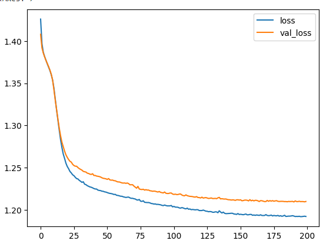
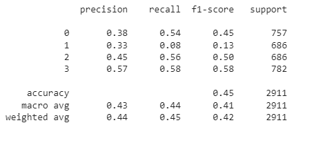

## Developing a Neural Network Classification Model

## AIM

To develop a neural network classification model for the given dataset.

## Problem Statement

An automobile company has plans to enter new markets with their existing products. After intensive market research, they’ve decided that the behavior of the new market is similar to their existing market.

In their existing market, the sales team has classified all customers into 4 segments (A, B, C, D ). Then, they performed segmented outreach and communication for a different segment of customers. This strategy has work exceptionally well for them. They plan to use the same strategy for the new markets.

You are required to help the manager to predict the right group of the new customers.

## Neural Network Model


## DESIGN STEPS
## STEP 1:
Import the necessary packages & modules.

## STEP 2:
Load and read the dataset.

## STEP 3:
Perform pre processing and clean the dataset.

## STEP 4:
Normalize the values and split the values for x and y.

## STEP 5:
Build the deep learning model with appropriate layers and depth.

## STEP 6:
Plot a graph for Training Loss, Validation Loss Vs Iteration & for Accuracy, Validation Accuracy vs Iteration.

## STEP 7:
Save the model using pickle.

## STEP 8:
Using the DL model predict for some random inputs.

## PROGRAM

## Name: PAVIZHI B
## Register Number:212221230077

```

import pandas as pd
from sklearn.model_selection import train_test_split
from tensorflow.keras.models import Sequential
from tensorflow.keras.models import load_model
import pickle
from tensorflow.keras.layers import Dense
from tensorflow.keras.layers import Dropout
from tensorflow.keras.layers import BatchNormalization
import tensorflow as tf
import seaborn as sns
from tensorflow.keras.callbacks import EarlyStopping
from sklearn.preprocessing import MinMaxScaler
from sklearn.preprocessing import LabelEncoder
from sklearn.preprocessing import OneHotEncoder
from sklearn.preprocessing import OrdinalEncoder
from sklearn.metrics import classification_report,confusion_matrix
import numpy as np
import matplotlib.pylab as plt
customer_df = pd.read_csv('customers.csv')
customer_df.head()
customer_df.columns
customer_df.dtypes
customer_df.shape
customer_df.isnull().sum()
customer_df_cleaned = customer_df.dropna(axis=0)
customer_df_cleaned.isnull().sum()
customer_df_cleaned.shape
customer_df_cleaned.dtypes
customer_df_cleaned['Gender'].unique()
customer_df_cleaned['Ever_Married'].unique()
customer_df_cleaned['Graduated'].unique()
categories_list=[['Male', 'Female'],
           ['No', 'Yes'],
           ['No', 'Yes'],
           ['Healthcare', 'Engineer', 'Lawyer', 'Artist', 'Doctor',
            'Homemaker', 'Entertainment', 'Marketing', 'Executive'],
           ['Low', 'Average', 'High']
           ]
enc = OrdinalEncoder(categories=categories_list)
customers_1 = customer_df_cleaned.copy()
customers_1[['Gender',
             'Ever_Married',
              'Graduated','Profession',
              'Spending_Score']] = enc.fit_transform(customers_1[['Gender','Ever_Married','Graduated','Profession','Spending_Score']])
le = LabelEncoder()
customers_1['Segmentation'] = le.fit_transform(customers_1['Segmentation'])
customers_1.dtypes
customers_1 = customers_1.drop('ID',axis=1)
customers_1 = customers_1.drop('Var_1',axis=1)
customers_1.dtypes
customers_1.describe()
customers_1['Segmentation'].unique()
X=customers_1[['Gender','Ever_Married','Age','Graduated','Profession','Work_Experience','Spending_Score','Family_Size']].values
y1 = customers_1[['Segmentation']].values
one_hot_enc = OneHotEncoder()
one_hot_enc.fit(y1)
y1.shape
y1[0]
y[0]
X_train,X_test,y_train,y_test=train_test_split(X,y,test_size=0.33,random_state=50)
X_train[0]
X_train.shape
scaler_age = MinMaxScaler()
scaler_age.fit(X_train[:,2].reshape(-1,1))
X_train_scaled = np.copy(X_train)
X_test_scaled = np.copy(X_test)
X_train_scaled[:,2] = scaler_age.transform(X_train[:,2].reshape(-1,1)).reshape(-1)
X_test_scaled[:,2] = scaler_age.transform(X_test[:,2].reshape(-1,1)).reshape(-1)
ai_brain = Sequential([
    Dense(units=7,activation='relu',input_shape=[8]),
    Dense(units=5,activation='relu'),
    Dense(units=3,activation='relu'),
    Dense(units=4,activation='softmax')
])
ai_brain.compile(optimizer='adam',
                 loss= 'categorical_crossentropy',
                 metrics=['accuracy'])
metrics = pd.DataFrame(ai_brain.history.history)
metrics.head()
metrics[['loss','val_loss']].plot()
x_test_predictions = np.argmax(ai_brain.predict(X_test_scaled), axis=1)
x_test_predictions.shape
y_test_truevalue = np.argmax(y_test,axis=1)
y_test_truevalue.shape
print(confusion_matrix(y_test_truevalue,x_test_predictions))
print(classification_report(y_test_truevalue,x_test_predictions))
ai_brain.save('customer_classification_model.h5')
with open('customer_data.pickle', 'wb') as fh:
   pickle.dump([X_train_scaled,y_train,X_test_scaled,y_test,customers_1,customer_df_cleaned,scaler_age,enc,one_hot_enc,le], fh)
ai_brain = load_model('customer_classification_model.h5')
with open('customer_data.pickle', 'rb') as fh:
   [X_train_scaled,y_train,X_test_scaled,y_test,customers_1,customer_df_cleaned,scaler_age,enc,one_hot_enc,le]=pickle.load(fh)
x_single_prediction = np.argmax(ai_brain.predict(X_test_scaled[1:2,:]), axis=1)
print(x_single_prediction)
print(le.inverse_transform(x_single_prediction))

```

## Dataset Information

## OUTPUT
## Training Loss, Validation Loss Vs Iteration Plot

## Classification Report

## Confusion Matrix

## New Sample Data Prediction


## RESULT
Thus a neural network classification model is developed for the given dataset.
